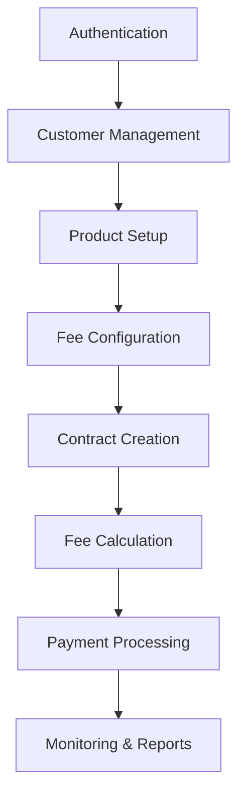
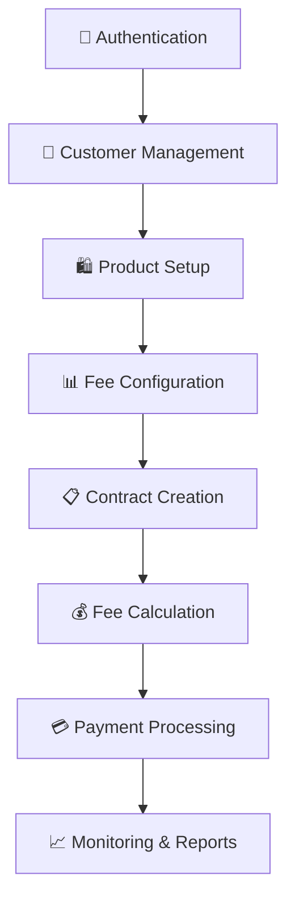

# Thứ tự API thực hiện chương trình từ đầu đến cuối

## Tổng quan workflow



---

## PHASE 1: Thiết lập hệ thống & Authentication

### 1.1 Tạo Admin và Users
```bash
# Tạo admin user đầu tiên
python manage.py createsuperuser
```

### 1.2 Authentication APIs
```http
# 1. Đăng nhập admin
POST /auth/login/
Content-Type: application/json

{
    "username": "admin",
    "password": "admin123"
}

# Response: Lưu access_token để dùng cho các API tiếp theo
{
    "access": "eyJ0eXAiOiJKV1QiLCJhbGciOiJIUzI1NiJ9...",
    "refresh": "eyJ0eXAiOiJKV1QiLCJhbGciOiJIUzI1NiJ9...",
    "user": {
        "username": "admin",
        "role": "admin"
    }
}
```

### 1.3 Tạo User accounts cho các vai trò
```http
# 2. Tạo Manager user
POST /auth/register/
Authorization: Bearer {access_token}
Content-Type: application/json

{
    "username": "manager1",
    "email": "manager@company.com",
    "phone": "0901234567",
    "password": "manager123",
    "role": "manager",
    "first_name": "Quản lý",
    "last_name": "Bảo hiểm"
}

# 3. Tạo Agent user
POST /auth/register/
Authorization: Bearer {access_token}

{
    "username": "agent1",
    "email": "agent1@company.com", 
    "phone": "0901234568",
    "password": "agent123",
    "role": "agent",
    "first_name": "Nguyễn Văn",
    "last_name": "Agent"
}

# 4. Tạo Customer user
POST /auth/register/
Authorization: Bearer {access_token}

{
    "username": "customer1",
    "email": "customer1@gmail.com",
    "phone": "0987654321", 
    "password": "customer123",
    "role": "customer",
    "first_name": "Trần Văn",
    "last_name": "Khách"
}
```

---

## PHASE 2: Thiết lập sản phẩm bảo hiểm

### 2.1 Tạo các sản phẩm bảo hiểm cơ bản
```http
# 5. Tạo sản phẩm bảo hiểm nhân thọ
POST /sanpham/
Authorization: Bearer {access_token}
Content-Type: application/json

{
    "ten_san_pham": "Bảo hiểm nhân thọ An Gia",
    "mo_ta": "Sản phẩm bảo hiểm nhân thọ với quyền lợi toàn diện cho gia đình",
    "loai_san_pham": "nhan_tho",
    "phi_bao_hiem_toi_thieu": 1000000,
    "phi_bao_hiem_toi_da": 50000000,
    "so_tien_bao_hiem_toi_thieu": 100000000,
    "so_tien_bao_hiem_toi_da": 5000000000,
    "thoi_han_toi_thieu": 12,
    "thoi_han_toi_da": 600,
    "tuoi_toi_thieu": 18,
    "tuoi_toi_da": 65,
    "ty_le_phi_quan_ly": 0.05,
    "trang_thai": "hoat_dong"
}

# 6. Tạo sản phẩm bảo hiểm sức khỏe
POST /sanpham/

{
    "ten_san_pham": "Bảo hiểm sức khỏe Toàn Diện",
    "mo_ta": "Bảo hiểm y tế với quyền lợi điều trị cao cấp",
    "loai_san_pham": "suc_khoe",
    "phi_bao_hiem_toi_thieu": 500000,
    "phi_bao_hiem_toi_da": 20000000,
    "so_tien_bao_hiem_toi_thieu": 50000000,
    "so_tien_bao_hiem_toi_da": 2000000000,
    "thoi_han_toi_thieu": 12,
    "thoi_han_toi_da": 120,
    "tuoi_toi_thieu": 0,
    "tuoi_toi_da": 70,
    "ty_le_phi_quan_ly": 0.03,
    "trang_thai": "hoat_dong"
}

# 7. Tạo sản phẩm bảo hiểm xe cơ giới
POST /sanpham/

{
    "ten_san_pham": "Bảo hiểm xe ô tô Vững Chắc",
    "mo_ta": "Bảo hiểm thiệt hại vật chất cho xe ô tô và mô tô",
    "loai_san_pham": "xe_co",
    "phi_bao_hiem_toi_thieu": 2000000,
    "phi_bao_hiem_toi_da": 100000000,
    "so_tien_bao_hiem_toi_thieu": 200000000,
    "so_tien_bao_hiem_toi_da": 5000000000,
    "thoi_han_toi_thieu": 12,
    "thoi_han_toi_da": 36,
    "tuoi_toi_thieu": 18,
    "tuoi_toi_da": 75,
    "ty_le_phi_quan_ly": 0.02,
    "trang_thai": "hoat_dong"
}
```

### 2.2 Xem danh sách sản phẩm đã tạo
```http
# 8. Lấy danh sách tất cả sản phẩm
GET /sanpham/
Authorization: Bearer {access_token}

# Response: Lưu ma_sp để dùng cho bước tiếp theo
{
    "message": "Danh sách sản phẩm",
    "count": 3,
    "data": [
        {
            "ma_sp": "NT123456",  // Lưu mã này
            "ten_san_pham": "Bảo hiểm nhân thọ An Gia",
            "loai_san_pham": "nhan_tho"
        }
    ]
}
```

---

## PHASE 3: Thiết lập bảng phí

### 3.1 Tạo bảng phí coi theo độ tuổi
```http
# 9. Tạo bảng phí coi cho nhóm tuổi 18-30
POST /phi-coi/
Authorization: Bearer {access_token}

{
    "san_pham": "NT123456",  // Dùng ma_sp từ bước 8
    "tuoi_tu": 18,
    "tuoi_den": 30,
    "menh_gia_tu": 100000000,
    "menh_gia_den": 1000000000,
    "ty_le_phi": 0.8,
    "phi_co_dinh": 50000
}

# 10. Tạo bảng phí coi cho nhóm tuổi 31-45
POST /phi-coi/

{
    "san_pham": "NT123456",
    "tuoi_tu": 31,
    "tuoi_den": 45,
    "menh_gia_tu": 100000000,
    "menh_gia_den": 1000000000,
    "ty_le_phi": 1.2,
    "phi_co_dinh": 80000
}

# 11. Tạo bảng phí coi cho nhóm tuổi 46-65
POST /phi-coi/

{
    "san_pham": "NT123456",
    "tuoi_tu": 46,
    "tuoi_den": 65,
    "menh_gia_tu": 100000000,
    "menh_gia_den": 1000000000,
    "ty_le_phi": 1.8,
    "phi_co_dinh": 120000
}
```

---

## PHASE 4: Quản lý khách hàng

### 4.1 Đăng nhập với tài khoản Agent
```http
# 12. Đăng nhập Agent để bán bảo hiểm
POST /auth/login/

{
    "username": "agent1",
    "password": "agent123"
}

# Lưu access_token của agent
```

### 4.2 Tạo hồ sơ khách hàng
```http
# 13. Tạo khách hàng đầu tiên
POST /khachhang/
Authorization: Bearer {agent_access_token}

{
    "ho_ten": "Nguyễn Văn An",
    "ngay_sinh": "1990-05-15",
    "gioi_tinh": "nam",
    "so_cmnd": "123456789012",
    "ngay_cap_cmnd": "2010-01-01",
    "noi_cap_cmnd": "CA TP.HCM",
    "so_dien_thoai": "0901234567",
    "email": "nguyenvanan@gmail.com",
    "nghe_nghiep": "Kỹ sư IT",
    "noi_lam_viec": "Công ty ABC Technology",
    "thu_nhap_hang_thang": 15000000,
    "ten_nguoi_thu_huong": "Nguyễn Thị Bình",
    "quan_he_nguoi_thu_huong": "Vợ",
    "dia_chi": {
        "street": "123 Nguyễn Huệ",
        "ward": "Phường Bến Nghé", 
        "district": "Quận 1",
        "city": "TP. Hồ Chí Minh",
        "postal_code": "70000"
    }
}

# Response: Lưu ma_kh để dùng cho hợp đồng
{
    "message": "Tạo khách hàng thành công",
    "data": {
        "ma_kh": "KH12345678",  // Lưu mã này
        "ho_ten": "Nguyễn Văn An",
        "tuoi": 34
    }
}

# 14. Tạo thêm khách hàng thứ 2
POST /khachhang/

{
    "ho_ten": "Trần Thị Bình",
    "ngay_sinh": "1985-08-20",
    "gioi_tinh": "nu",
    "so_cmnd": "987654321098",
    "ngay_cap_cmnd": "2008-06-15",
    "noi_cap_cmnd": "CA TP.HCM",
    "so_dien_thoai": "0907654321",
    "email": "tranthibinh@gmail.com",
    "nghe_nghiep": "Giáo viên",
    "noi_lam_viec": "Trường THPT XYZ",
    "thu_nhap_hang_thang": 8000000,
    "ten_nguoi_thu_huong": "Trần Văn Cường",
    "quan_he_nguoi_thu_huong": "Con trai"
}
```

---

## PHASE 5: Tạo hợp đồng bảo hiểm

### 5.1 Tính phí trước khi tạo hợp đồng
```http
# 15. Test tính phí coi cho khách hàng
GET /phi-coi/?ma_sp=NT123456&tuoi=34&menh_gia=500000000
Authorization: Bearer {agent_access_token}

# Response: Kiểm tra phí hợp lý
{
    "message": "Tính phí coi thành công",
    "thong_tin_dau_vao": {
        "ma_sp": "NT123456",
        "tuoi": 34,
        "menh_gia": 500000000
    },
    "ket_qua": {
        "phi_coi": 4080000,  // Phí coi đã tính
        "phuong_thuc_tinh": "Bảng phí coi PC12345678"
    }
}
```

### 5.2 Tạo hợp đồng bảo hiểm
```http
# 16. Tạo hợp đồng cho khách hàng Nguyễn Văn An
POST /hopdong/
Authorization: Bearer {agent_access_token}

{
    "khach_hang": "KH12345678",  // Từ bước 13
    "san_pham": "NT123456",     // Từ bước 8
    "ngay_ky": "2024-12-20",
    "ngay_hieu_luc": "2024-12-21",
    "ngay_ket_thuc": "2029-12-21",
    "so_tien_bao_hiem": 500000000,
    "phi_bao_hiem": 5000000,
    "ky_han_dong_phi": "hang_thang",
    "trang_thai": "cho_duyet",
    "ten_nguoi_thu_huong": "Nguyễn Thị Bình",
    "quan_he_nguoi_thu_huong": "Vợ",
    "ghi_chu": "Hợp đồng bảo hiểm nhân thọ 5 năm"
}

# Response: Lưu ma_hd
{
    "message": "Tạo hợp đồng thành công",
    "data": {
        "ma_hd": "HD87654321",  // Lưu mã này
        "trang_thai": "cho_duyet"
    }
}
```

### 5.3 Manager duyệt hợp đồng
```http
# 17. Đăng nhập Manager
POST /auth/login/

{
    "username": "manager1",
    "password": "manager123"
}

# 18. Duyệt hợp đồng
PATCH /hopdong/HD87654321/
Authorization: Bearer {manager_access_token}

{
    "trang_thai": "hoat_dong",
    "ghi_chu": "Hợp đồng đã được duyệt và có hiệu lực"
}
```

---

## PHASE 6: Quản lý phí và thanh toán

### 6.1 Tính phí chi tiết cho hợp đồng
```http
# 19. Tính phí tháng hiện tại
GET /hopdong/HD87654321/tinh-phi/?thang_nam=2024-12
Authorization: Bearer {agent_access_token}

# Response: Chi tiết các loại phí
{
    "message": "Tính phí cho hợp đồng HD87654321",
    "ma_hd": "HD87654321",
    "thang_nam": "2024-12",
    "chi_tiet_phi": {
        "phi_bao_hiem": 5000000,
        "phi_quan_ly": 250000,     // 5% của phí bảo hiểm
        "phi_coi": 4080000,        // Từ bảng phí coi
        "tong_phi": 9330000        // Tổng phí phải thanh toán
    }
}
```

### 6.2 Tạo phí thanh toán
```http
# 20. Tạo phí thanh toán cho tháng 12/2024
POST /phi-thanhtoan/tao-moi/
Authorization: Bearer {agent_access_token}

{
    "hop_dong": "HD87654321",
    "thang_nam": "2024-12-01",
    "phi_bao_hiem": 5000000,
    "phi_quan_ly": 250000,
    "phi_coi": 4080000,
    "ngay_dao_han": "2024-12-15"
}

# Response: Lưu ma_phi_tt
{
    "message": "Tạo phí thanh toán thành công",
    "data": {
        "ma_phi_tt": "PTT9876543",  // Lưu mã này
        "tong_phi": 9330000
    }
}
```

### 6.3 Xử lý thanh toán
```http
# 21. Khách hàng thanh toán
POST /thanh-toan/
Authorization: Bearer {agent_access_token}

{
    "hop_dong": "HD87654321",
    "phi_thanh_toan": "PTT9876543",
    "so_tien": 9330000,
    "phuong_thuc_thanh_toan": "chuyen_khoan",
    "ma_giao_dich_ngan_hang": "VCB20241220123456",
    "ten_ngan_hang": "Vietcombank",
    "ghi_chu": "Thanh toán phí bảo hiểm tháng 12/2024"
}

# Response: Xác nhận thanh toán
{
    "message": "Tạo thanh toán thành công",
    "data": {
        "ma_thanh_toan": "TT11111111",
        "trang_thai": "cho_xu_ly"
    }
}

# 22. Agent xác nhận thanh toán thành công
PATCH /thanh-toan/TT11111111/
Authorization: Bearer {agent_access_token}

{
    "trang_thai": "thanh_cong",
    "ghi_chu": "Đã xác nhận giao dịch thành công"
}
```

---

## PHASE 7: Monitoring và Báo cáo

### 7.1 Theo dõi hợp đồng
```http
# 23. Xem danh sách hợp đồng hoạt động
GET /hopdong/?trang_thai=hoat_dong
Authorization: Bearer {manager_access_token}

# 24. Xem chi tiết thanh toán theo hợp đồng
GET /thanh-toan/HD87654321/
Authorization: Bearer {manager_access_token}

# 25. Kiểm tra công nợ
GET /thanh-toan/con-no/HD87654321/
Authorization: Bearer {manager_access_token}
```

### 7.2 Báo cáo tổng hợp
```http
# 26. Xem tất cả thanh toán trong hệ thống
GET /thanh-toan/?tu_ngay=2024-12-01&den_ngay=2024-12-31
Authorization: Bearer {manager_access_token}

# 27. Danh sách khách hàng
GET /khachhang/
Authorization: Bearer {manager_access_token}

# 28. Thống kê sản phẩm
GET /sanpham/
Authorization: Bearer {manager_access_token}
```

---

## PHASE 8: Workflow định kỳ (Monthly)

### 8.1 Tạo phí tháng tiếp theo
```http
# 29. Tạo phí tháng 01/2025
POST /phi-thanhtoan/tao-moi/

{
    "hop_dong": "HD87654321",
    "thang_nam": "2025-01-01",
    "phi_bao_hiem": 5000000,
    "phi_quan_ly": 250000,
    "phi_coi": 4080000,
    "ngay_dao_han": "2025-01-15"
}

# 30. Kiểm tra công nợ quá hạn (nếu khách không thanh toán)
GET /thanh-toan/con-no/HD87654321/
```

### 8.2 Customer self-service (đăng nhập khách hàng)
```http
# 31. Khách hàng đăng nhập để xem thông tin
POST /auth/login/

{
    "username": "customer1", 
    "password": "customer123"
}

# 32. Xem hợp đồng của mình
GET /hopdong/
Authorization: Bearer {customer_access_token}

# 33. Xem lịch sử thanh toán
GET /thanh-toan/HD87654321/
Authorization: Bearer {customer_access_token}

# 34. Kiểm tra phí cần thanh toán
GET /phi-thanhtoan/HD87654321/
Authorization: Bearer {customer_access_token}
```

---

## Tóm tắt thứ tự API hoàn chỉnh

### Setup Phase (1-4)
1. Tạo admin user
2-4. Tạo các user roles (manager, agent, customer)

### Product Setup (5-8)  
5-7. Tạo 3 sản phẩm bảo hiểm
8. Lấy danh sách sản phẩm

### Fee Configuration (9-11)
9-11. Tạo bảng phí coi cho 3 nhóm tuổi

### Customer Management (12-14)
12. Đăng nhập agent
13-14. Tạo khách hàng

### Contract Creation (15-18)
15. Test tính phí
16. Tạo hợp đồng
17. Manager đăng nhập
18. Duyệt hợp đồng

### Payment Processing (19-22)
19. Tính phí chi tiết
20. Tạo phí thanh toán
21. Xử lý thanh toán
22. Xác nhận thanh toán

### Monitoring (23-28)
23-28. Các API báo cáo và theo dõi

### Recurring (29-34)
29-34. Workflow hàng tháng và customer portal

**Tổng cộng: 34 API calls tạo thành workflow hoàn chỉnh**# 🔄 Thứ tự API thực hiện chương trình từ đầu đến cuối

## 📋 Tổng quan workflow



---

## 🚀 PHASE 1: Thiết lập hệ thống & Authentication

### 1.1 Tạo Admin và Users
```bash
# Tạo admin user đầu tiên
python manage.py createsuperuser
```

### 1.2 Authentication APIs
```http
# 1. Đăng nhập admin
POST /auth/login/
Content-Type: application/json

{
    "username": "admin",
    "password": "admin123"
}

# Response: Lưu access_token để dùng cho các API tiếp theo
{
    "access": "eyJ0eXAiOiJKV1QiLCJhbGciOiJIUzI1NiJ9...",
    "refresh": "eyJ0eXAiOiJKV1QiLCJhbGciOiJIUzI1NiJ9...",
    "user": {
        "username": "admin",
        "role": "admin"
    }
}
```

### 1.3 Tạo User accounts cho các vai trò
```http
# 2. Tạo Manager user
POST /auth/register/
Authorization: Bearer {access_token}
Content-Type: application/json

{
    "username": "manager1",
    "email": "manager@company.com",
    "phone": "0901234567",
    "password": "manager123",
    "role": "manager",
    "first_name": "Quản lý",
    "last_name": "Bảo hiểm"
}

# 3. Tạo Agent user
POST /auth/register/
Authorization: Bearer {access_token}

{
    "username": "agent1",
    "email": "agent1@company.com", 
    "phone": "0901234568",
    "password": "agent123",
    "role": "agent",
    "first_name": "Nguyễn Văn",
    "last_name": "Agent"
}

# 4. Tạo Customer user
POST /auth/register/
Authorization: Bearer {access_token}

{
    "username": "customer1",
    "email": "customer1@gmail.com",
    "phone": "0987654321", 
    "password": "customer123",
    "role": "customer",
    "first_name": "Trần Văn",
    "last_name": "Khách"
}
```

---

## 🛍️ PHASE 2: Thiết lập sản phẩm bảo hiểm

### 2.1 Tạo các sản phẩm bảo hiểm cơ bản
```http
# 5. Tạo sản phẩm bảo hiểm nhân thọ
POST /sanpham/
Authorization: Bearer {access_token}
Content-Type: application/json

{
    "ten_san_pham": "Bảo hiểm nhân thọ An Gia",
    "mo_ta": "Sản phẩm bảo hiểm nhân thọ với quyền lợi toàn diện cho gia đình",
    "loai_san_pham": "nhan_tho",
    "phi_bao_hiem_toi_thieu": 1000000,
    "phi_bao_hiem_toi_da": 50000000,
    "so_tien_bao_hiem_toi_thieu": 100000000,
    "so_tien_bao_hiem_toi_da": 5000000000,
    "thoi_han_toi_thieu": 12,
    "thoi_han_toi_da": 600,
    "tuoi_toi_thieu": 18,
    "tuoi_toi_da": 65,
    "ty_le_phi_quan_ly": 0.05,
    "trang_thai": "hoat_dong"
}

# 6. Tạo sản phẩm bảo hiểm sức khỏe
POST /sanpham/

{
    "ten_san_pham": "Bảo hiểm sức khỏe Toàn Diện",
    "mo_ta": "Bảo hiểm y tế với quyền lợi điều trị cao cấp",
    "loai_san_pham": "suc_khoe",
    "phi_bao_hiem_toi_thieu": 500000,
    "phi_bao_hiem_toi_da": 20000000,
    "so_tien_bao_hiem_toi_thieu": 50000000,
    "so_tien_bao_hiem_toi_da": 2000000000,
    "thoi_han_toi_thieu": 12,
    "thoi_han_toi_da": 120,
    "tuoi_toi_thieu": 0,
    "tuoi_toi_da": 70,
    "ty_le_phi_quan_ly": 0.03,
    "trang_thai": "hoat_dong"
}

# 7. Tạo sản phẩm bảo hiểm xe cơ giới
POST /sanpham/

{
    "ten_san_pham": "Bảo hiểm xe ô tô Vững Chắc",
    "mo_ta": "Bảo hiểm thiệt hại vật chất cho xe ô tô và mô tô",
    "loai_san_pham": "xe_co",
    "phi_bao_hiem_toi_thieu": 2000000,
    "phi_bao_hiem_toi_da": 100000000,
    "so_tien_bao_hiem_toi_thieu": 200000000,
    "so_tien_bao_hiem_toi_da": 5000000000,
    "thoi_han_toi_thieu": 12,
    "thoi_han_toi_da": 36,
    "tuoi_toi_thieu": 18,
    "tuoi_toi_da": 75,
    "ty_le_phi_quan_ly": 0.02,
    "trang_thai": "hoat_dong"
}
```

### 2.2 Xem danh sách sản phẩm đã tạo
```http
# 8. Lấy danh sách tất cả sản phẩm
GET /sanpham/
Authorization: Bearer {access_token}

# Response: Lưu ma_sp để dùng cho bước tiếp theo
{
    "message": "Danh sách sản phẩm",
    "count": 3,
    "data": [
        {
            "ma_sp": "NT123456",  // ← Lưu mã này
            "ten_san_pham": "Bảo hiểm nhân thọ An Gia",
            "loai_san_pham": "nhan_tho"
        }
    ]
}
```

---

## 💰 PHASE 3: Thiết lập bảng phí

### 3.1 Tạo bảng phí coi theo độ tuổi
```http
# 9. Tạo bảng phí coi cho nhóm tuổi 18-30
POST /phi-coi/
Authorization: Bearer {access_token}

{
    "san_pham": "NT123456",  // Dùng ma_sp từ bước 8
    "tuoi_tu": 18,
    "tuoi_den": 30,
    "menh_gia_tu": 100000000,
    "menh_gia_den": 1000000000,
    "ty_le_phi": 0.8,
    "phi_co_dinh": 50000
}

# 10. Tạo bảng phí coi cho nhóm tuổi 31-45
POST /phi-coi/

{
    "san_pham": "NT123456",
    "tuoi_tu": 31,
    "tuoi_den": 45,
    "menh_gia_tu": 100000000,
    "menh_gia_den": 1000000000,
    "ty_le_phi": 1.2,
    "phi_co_dinh": 80000
}

# 11. Tạo bảng phí coi cho nhóm tuổi 46-65
POST /phi-coi/

{
    "san_pham": "NT123456",
    "tuoi_tu": 46,
    "tuoi_den": 65,
    "menh_gia_tu": 100000000,
    "menh_gia_den": 1000000000,
    "ty_le_phi": 1.8,
    "phi_co_dinh": 120000
}
```

---

## 👥 PHASE 4: Quản lý khách hàng

### 4.1 Đăng nhập với tài khoản Agent
```http
# 12. Đăng nhập Agent để bán bảo hiểm
POST /auth/login/

{
    "username": "agent1",
    "password": "agent123"
}

# Lưu access_token của agent
```

### 4.2 Tạo hồ sơ khách hàng
```http
# 13. Tạo khách hàng đầu tiên
POST /khachhang/
Authorization: Bearer {agent_access_token}

{
    "ho_ten": "Nguyễn Văn An",
    "ngay_sinh": "1990-05-15",
    "gioi_tinh": "nam",
    "so_cmnd": "123456789012",
    "ngay_cap_cmnd": "2010-01-01",
    "noi_cap_cmnd": "CA TP.HCM",
    "so_dien_thoai": "0901234567",
    "email": "nguyenvanan@gmail.com",
    "nghe_nghiep": "Kỹ sư IT",
    "noi_lam_viec": "Công ty ABC Technology",
    "thu_nhap_hang_thang": 15000000,
    "ten_nguoi_thu_huong": "Nguyễn Thị Bình",
    "quan_he_nguoi_thu_huong": "Vợ",
    "dia_chi": {
        "street": "123 Nguyễn Huệ",
        "ward": "Phường Bến Nghé", 
        "district": "Quận 1",
        "city": "TP. Hồ Chí Minh",
        "postal_code": "70000"
    }
}

# Response: Lưu ma_kh để dùng cho hợp đồng
{
    "message": "Tạo khách hàng thành công",
    "data": {
        "ma_kh": "KH12345678",  // ← Lưu mã này
        "ho_ten": "Nguyễn Văn An",
        "tuoi": 34
    }
}

# 14. Tạo thêm khách hàng thứ 2
POST /khachhang/

{
    "ho_ten": "Trần Thị Bình",
    "ngay_sinh": "1985-08-20",
    "gioi_tinh": "nu",
    "so_cmnd": "987654321098",
    "ngay_cap_cmnd": "2008-06-15",
    "noi_cap_cmnd": "CA TP.HCM",
    "so_dien_thoai": "0907654321",
    "email": "tranthibinh@gmail.com",
    "nghe_nghiep": "Giáo viên",
    "noi_lam_viec": "Trường THPT XYZ",
    "thu_nhap_hang_thang": 8000000,
    "ten_nguoi_thu_huong": "Trần Văn Cường",
    "quan_he_nguoi_thu_huong": "Con trai"
}
```

---

## 📋 PHASE 5: Tạo hợp đồng bảo hiểm

### 5.1 Tính phí trước khi tạo hợp đồng
```http
# 15. Test tính phí coi cho khách hàng
GET /phi-coi/?ma_sp=NT123456&tuoi=34&menh_gia=500000000
Authorization: Bearer {agent_access_token}

# Response: Kiểm tra phí hợp lý
{
    "message": "Tính phí coi thành công",
    "thong_tin_dau_vao": {
        "ma_sp": "NT123456",
        "tuoi": 34,
        "menh_gia": 500000000
    },
    "ket_qua": {
        "phi_coi": 4080000,  // ← Phí coi đã tính
        "phuong_thuc_tinh": "Bảng phí coi PC12345678"
    }
}
```

### 5.2 Tạo hợp đồng bảo hiểm
```http
# 16. Tạo hợp đồng cho khách hàng Nguyễn Văn An
POST /hopdong/
Authorization: Bearer {agent_access_token}

{
    "khach_hang": "KH12345678",  // Từ bước 13
    "san_pham": "NT123456",     // Từ bước 8
    "ngay_ky": "2024-12-20",
    "ngay_hieu_luc": "2024-12-21",
    "ngay_ket_thuc": "2029-12-21",
    "so_tien_bao_hiem": 500000000,
    "phi_bao_hiem": 5000000,
    "ky_han_dong_phi": "hang_thang",
    "trang_thai": "cho_duyet",
    "ten_nguoi_thu_huong": "Nguyễn Thị Bình",
    "quan_he_nguoi_thu_huong": "Vợ",
    "ghi_chu": "Hợp đồng bảo hiểm nhân thọ 5 năm"
}

# Response: Lưu ma_hd
{
    "message": "Tạo hợp đồng thành công",
    "data": {
        "ma_hd": "HD87654321",  // ← Lưu mã này
        "trang_thai": "cho_duyet"
    }
}
```

### 5.3 Manager duyệt hợp đồng
```http
# 17. Đăng nhập Manager
POST /auth/login/

{
    "username": "manager1",
    "password": "manager123"
}

# 18. Duyệt hợp đồng
PATCH /hopdong/HD87654321/
Authorization: Bearer {manager_access_token}

{
    "trang_thai": "hoat_dong",
    "ghi_chu": "Hợp đồng đã được duyệt và có hiệu lực"
}
```

---

## 💰 PHASE 6: Quản lý phí và thanh toán

### 6.1 Tính phí chi tiết cho hợp đồng
```http
# 19. Tính phí tháng hiện tại
GET /hopdong/HD87654321/tinh-phi/?thang_nam=2024-12
Authorization: Bearer {agent_access_token}

# Response: Chi tiết các loại phí
{
    "message": "Tính phí cho hợp đồng HD87654321",
    "ma_hd": "HD87654321",
    "thang_nam": "2024-12",
    "chi_tiet_phi": {
        "phi_bao_hiem": 5000000,
        "phi_quan_ly": 250000,     // 5% của phí bảo hiểm
        "phi_coi": 4080000,        // Từ bảng phí coi
        "tong_phi": 9330000        // Tổng phí phải thanh toán
    }
}
```

### 6.2 Tạo phí thanh toán
```http
# 20. Tạo phí thanh toán cho tháng 12/2024
POST /phi-thanhtoan/tao-moi/
Authorization: Bearer {agent_access_token}

{
    "hop_dong": "HD87654321",
    "thang_nam": "2024-12-01",
    "phi_bao_hiem": 5000000,
    "phi_quan_ly": 250000,
    "phi_coi": 4080000,
    "ngay_dao_han": "2024-12-15"
}

# Response: Lưu ma_phi_tt
{
    "message": "Tạo phí thanh toán thành công",
    "data": {
        "ma_phi_tt": "PTT9876543",  // ← Lưu mã này
        "tong_phi": 9330000
    }
}
```

### 6.3 Xử lý thanh toán
```http
# 21. Khách hàng thanh toán
POST /thanh-toan/
Authorization: Bearer {agent_access_token}

{
    "hop_dong": "HD87654321",
    "phi_thanh_toan": "PTT9876543",
    "so_tien": 9330000,
    "phuong_thuc_thanh_toan": "chuyen_khoan",
    "ma_giao_dich_ngan_hang": "VCB20241220123456",
    "ten_ngan_hang": "Vietcombank",
    "ghi_chu": "Thanh toán phí bảo hiểm tháng 12/2024"
}

# Response: Xác nhận thanh toán
{
    "message": "Tạo thanh toán thành công",
    "data": {
        "ma_thanh_toan": "TT11111111",
        "trang_thai": "cho_xu_ly"
    }
}

# 22. Agent xác nhận thanh toán thành công
PATCH /thanh-toan/TT11111111/
Authorization: Bearer {agent_access_token}

{
    "trang_thai": "thanh_cong",
    "ghi_chu": "Đã xác nhận giao dịch thành công"
}
```

---

## 📊 PHASE 7: Monitoring và Báo cáo

### 7.1 Theo dõi hợp đồng
```http
# 23. Xem danh sách hợp đồng hoạt động
GET /hopdong/?trang_thai=hoat_dong
Authorization: Bearer {manager_access_token}

# 24. Xem chi tiết thanh toán theo hợp đồng
GET /thanh-toan/HD87654321/
Authorization: Bearer {manager_access_token}

# 25. Kiểm tra công nợ
GET /thanh-toan/con-no/HD87654321/
Authorization: Bearer {manager_access_token}
```

### 7.2 Báo cáo tổng hợp
```http
# 26. Xem tất cả thanh toán trong hệ thống
GET /thanh-toan/?tu_ngay=2024-12-01&den_ngay=2024-12-31
Authorization: Bearer {manager_access_token}

# 27. Danh sách khách hàng
GET /khachhang/
Authorization: Bearer {manager_access_token}

# 28. Thống kê sản phẩm
GET /sanpham/
Authorization: Bearer {manager_access_token}
```

---

## 🔄 PHASE 8: Workflow định kỳ (Monthly)

### 8.1 Tạo phí tháng tiếp theo
```http
# 29. Tạo phí tháng 01/2025
POST /phi-thanhtoan/tao-moi/

{
    "hop_dong": "HD87654321",
    "thang_nam": "2025-01-01",
    "phi_bao_hiem": 5000000,
    "phi_quan_ly": 250000,
    "phi_coi": 4080000,
    "ngay_dao_han": "2025-01-15"
}

# 30. Kiểm tra công nợ quá hạn (nếu khách không thanh toán)
GET /thanh-toan/con-no/HD87654321/
```

### 8.2 Customer self-service (đăng nhập khách hàng)
```http
# 31. Khách hàng đăng nhập để xem thông tin
POST /auth/login/

{
    "username": "customer1", 
    "password": "customer123"
}

# 32. Xem hợp đồng của mình
GET /hopdong/
Authorization: Bearer {customer_access_token}

# 33. Xem lịch sử thanh toán
GET /thanh-toan/HD87654321/
Authorization: Bearer {customer_access_token}

# 34. Kiểm tra phí cần thanh toán
GET /phi-thanhtoan/HD87654321/
Authorization: Bearer {customer_access_token}
```

---

## 📋 Tóm tắt thứ tự API hoàn chỉnh

### 🔧 **Setup Phase** (1-4)
1. Tạo admin user
2-4. Tạo các user roles (manager, agent, customer)

### 🛍️ **Product Setup** (5-8)  
5-7. Tạo 3 sản phẩm bảo hiểm
8. Lấy danh sách sản phẩm

### 💰 **Fee Configuration** (9-11)
9-11. Tạo bảng phí coi cho 3 nhóm tuổi

### 👥 **Customer Management** (12-14)
12. Đăng nhập agent
13-14. Tạo khách hàng

### 📋 **Contract Creation** (15-18)
15. Test tính phí
16. Tạo hợp đồng
17. Manager đăng nhập
18. Duyệt hợp đồng

### 💳 **Payment Processing** (19-22)
19. Tính phí chi tiết
20. Tạo phí thanh toán
21. Xử lý thanh toán
22. Xác nhận thanh toán

### 📊 **Monitoring** (23-28)
23-28. Các API báo cáo và theo dõi

### 🔄 **Recurring** (29-34)
29-34. Workflow hàng tháng và customer portal

**Tổng cộng: 34 API calls tạo thành workflow hoàn chỉnh!** 🚀